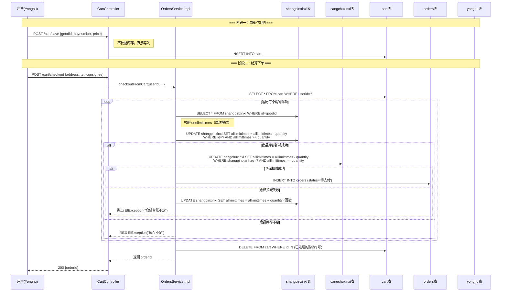
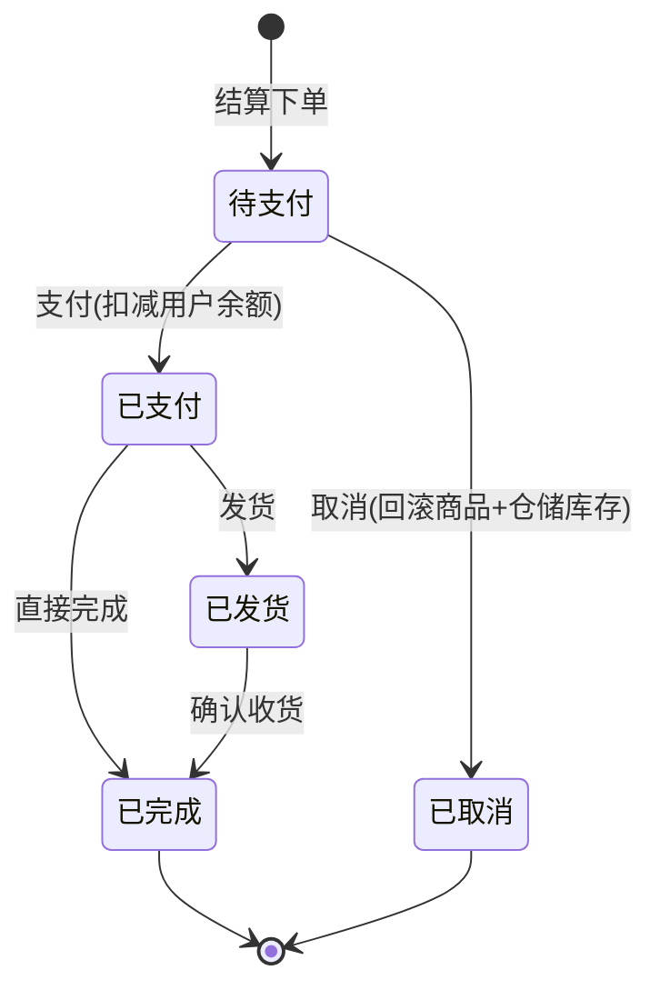
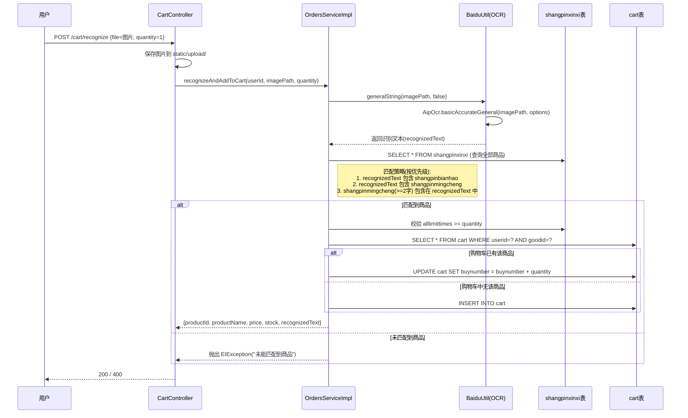
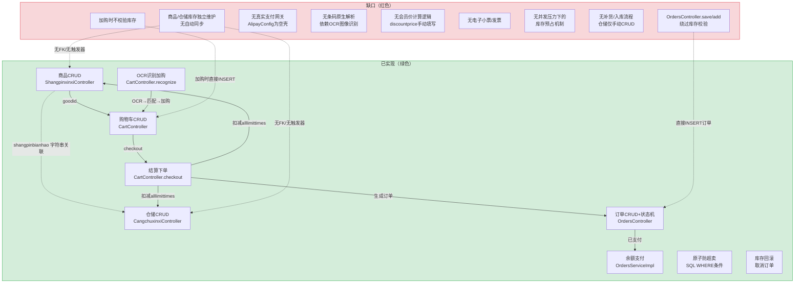
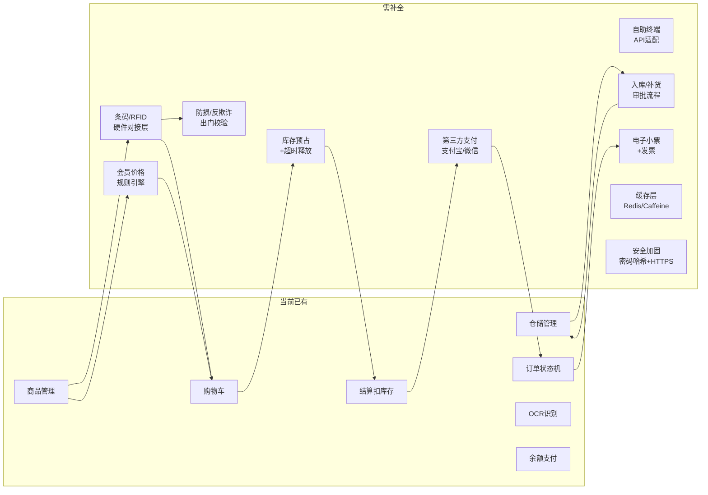

# 商品-仓储-购物车-订单数据流说明

> **文档版本**: 1.0
> **审计基准**: `springbootniyfl/` 全部 Java 源码与 Mapper XML
> **日期**: 2026-06-13

---

## 一、核心实体关系

### 1.1 四张核心表

| 表名 | 对应实体 | 核心字段 | 职责 |
|---|---|---|---|
| `shangpinxinxi` | `ShangpinxinxiEntity` | `id`, `shangpinbianhao`(编号), `shangpinmingcheng`(名称), `shangpinfenlei`(分类), `price`(单价), `alllimittimes`(总库存), `onelimittimes`(单次限购) | 商品主数据 + 前台库存 |
| `cangchuxinxi` | `CangchuxinxiEntity` | `id`, `shangpinbianhao`(编号), `shangpinmingcheng`(名称), `shengchanchangjia`(厂家), `alllimittimes`(上架数量) | 仓储台账（仓库侧库存） |
| `cart` | `CartEntity` | `id`, `userid`, `goodid`, `goodname`, `buynumber`(购买数量), `price`(单价), `discountprice`(会员价), `goodtype`(分类) | 用户购物车 |
| `orders` | `OrdersEntity` | `id`, `orderid`(订单号), `userid`, `goodid`, `buynumber`, `price`, `total`, `status`, `address`, `consignee` | 订单记录 |

### 1.2 实体间关联方式

```
shangpinxinxi.id ←──(goodid)── cart.goodid
shangpinxinxi.id ←──(goodid)── orders.goodid
shangpinxinxi.shangpinbianhao ←──(shangpinbianhao)── cangchuxinxi.shangpinbianhao
cart.userid ──→ yonghu.id
orders.userid ──→ yonghu.id
```

**关键问题**: `shangpinxinxi` 与 `cangchuxinxi` 之间通过 `shangpinbianhao`（字符串）松耦合关联，**无数据库外键约束**。这意味着：
- 若商品编号修改，仓储记录不会自动同步
- 若仓储记录缺失某个商品编号，结算时仓储扣减会失败但商品库存已扣（代码中有手动回滚处理）

---

## 二、当前数据流（完整链路）

### 2.1 正常购物结算流程



### 2.2 订单状态流转



**状态机实现位置**: `OrdersServiceImpl.updateOrderStatus()` (第 240-277 行)

**状态变更附带操作**:

| 变更 | 附带操作 | 代码位置 |
|---|---|---|
| 待支付 → 已取消 | `restoreStockForOrder()`: 恢复 shangpinxinxi.alllimittimes + cangchuxinxi.alllimittimes | `OrdersServiceImpl:282-295` |
| 待支付 → 已支付 | `deductUserBalance()`: 扣减 yonghu.money（用户余额） | `OrdersServiceImpl:300-316` |
| 其他变更 | 仅更新 orders.status 字段 | — |

### 2.3 OCR 扫码加购流程



---

## 三、当前链路缺口分析

### 3.1 总览（Mermaid 数据流图）



### 3.2 逐项缺口说明

#### 缺口 1: 加购时不校验库存

| 项目 | 说明 |
|---|---|
| **位置** | `CartController.save()` / `CartController.add()` |
| **现状** | 直接 `cartService.insert(cart)` 写入购物车，不检查商品是否存在、是否有库存 |
| **风险** | 用户可加购已下架商品或库存为 0 的商品，直到结算时才会失败 |
| **建议** | 加购前查询 `shangpinxinxi.alllimittimes`，库存不足时拒绝加购 |

#### 缺口 2: 商品库存与仓储台账独立维护

| 项目 | 说明 |
|---|---|
| **位置** | `shangpinxinxi.alllimittimes` vs `cangchuxinxi.alllimittimes` |
| **现状** | 两个表各自维护一个 `alllimittimes` 字段，仅在 `checkoutFromCart()` 中同时扣减。日常商品管理（增删改）不会同步另一张表 |
| **风险** | 管理员通过 `ShangpinxinxiController.update()` 修改商品库存时，仓储台账不会同步变更，导致结算时两侧数量不一致 |
| **建议** | 要么合并为单一库存源，要么建立入库/出库流程保持两侧一致 |

#### 缺口 3: OrdersController.save/add 绕过库存校验

| 项目 | 说明 |
|---|---|
| **位置** | `OrdersController.save()` (第 128-133 行) 和 `OrdersController.add()` (第 139-143 行) |
| **现状** | 这两个端点直接 `ordersService.insert(orders)` 写入订单，**完全不校验库存、不扣减库存、不检查商品是否存在** |
| **风险** | 通过 API 直接调用 `/orders/save` 或 `/orders/add` 可以绕过整个库存管控流程 |
| **建议** | 如果这些端点仅供管理员使用，需加权限控制；如果是遗留接口，建议废弃或转发到 `checkoutFromCart` |

#### 缺口 4: 无真实支付网关

| 项目 | 说明 |
|---|---|
| **位置** | `AlipayConfig.java` (空类)，`OrdersServiceImpl.deductUserBalance()` |
| **现状** | 仅有"余额支付"——直接扣减 `yonghu.money` 字段。无支付宝、微信支付、银联等真实支付网关 |
| **风险** | 无人超市场景下无法对接扫码支付终端 |
| **建议** | 集成支付宝/微信支付 SDK，实现支付回调 → 状态变更的异步流程 |

#### 缺口 5: 无条码原生解析

| 项目 | 说明 |
|---|---|
| **位置** | `CartController.recognize()` → `BaiduUtil.generalString()` |
| **现状** | "扫码"功能实际是拍照 → 百度 OCR 文字识别 → 在商品表中字符串匹配。不是真正的条码/二维码解析 |
| **风险** | OCR 文字识别准确率受图片质量影响大，且无法识别标准条码（EAN-13/Code128 等） |
| **建议** | 引入 ZXing 等条码解析库，支持 EAN-13/QR Code 原生解码 |

#### 缺口 6: 无会员价自动计算

| 项目 | 说明 |
|---|---|
| **位置** | `CartEntity.discountprice`，`OrdersEntity.discountprice` / `discounttotal` |
| **现状** | `discountprice` 字段存在但由前端/管理员手动填写。`checkoutFromCart()` 中折扣总价计算为 `discountprice * buynumber`，但 `discountprice` 可能为 null |
| **风险** | 无会员等级/折扣规则引擎，无法实现自动定价策略 |

#### 缺口 7: 无库存预占（库存锁定）

| 项目 | 说明 |
|---|---|
| **现状** | 库存仅在结算瞬间扣减，购物车中的商品不会预占库存 |
| **风险** | 用户 A 加购最后 1 件商品到购物车但未结算，用户 B 也能加购同一商品到购物车。最终只有一人能成功结算 |
| **建议** | 可增加"预占库存 + 超时释放"机制，或在加购/结算之间增加库存校验 |

#### 缺口 8: 无补货/入库流程

| 项目 | 说明 |
|---|---|
| **现状** | `CangchuxinxiController` 仅提供标准 CRUD，无入库单、补货审批、供应商管理等流程 |
| **风险** | 库存补充只能通过管理员手动修改 `alllimittimes` 字段，无操作记录、无审计追踪 |

#### 缺口 9: 无电子小票/发票

| 项目 | 说明 |
|---|---|
| **现状** | 订单完成后无小票生成、无发票开具能力 |
| **风险** | 无人超市场景下用户无法获得购物凭证 |

---

## 四、完整无人收银所需补全环节

若要基于当前系统实现一套完整的无人收银方案，需补全以下环节：



### 各补全项说明

| 序号 | 补全项 | 优先级 | 说明 |
|---|---|---|---|
| N1 | 条码/RFID 硬件对接 | **高** | 引入 ZXing 条码解析库；对接 RFID 读卡器 SDK，实现商品自动识别 |
| N2 | 第三方支付网关 | **高** | 集成支付宝当面付 / 微信支付 JSAPI，实现扫码支付 + 异步回调通知 |
| N3 | 自助终端 API 适配 | **高** | 提供 WebSocket 或轮询接口供自助终端设备调用，包含扫码、支付、打印小票等指令 |
| N4 | 库存预占 + 超时释放 | **中** | 加购或进入结算页时预占库存，设定 15 分钟超时自动释放（需 Redis 或定时任务支持） |
| N5 | 入库/补货流程 | **中** | 建立入库单 → 审核 → 仓储/商品库存同步增加的完整流程，留操作日志 |
| N6 | 电子小票 + 发票 | **中** | 订单完成后生成电子小票（PDF/HTML），可选对接税控系统开具电子发票 |
| N7 | 防损/出门校验 | **中** | 对接闸机或 RFID 门禁，校验用户已支付商品清单与实际携带商品一致 |
| N8 | 会员价格规则引擎 | **低** | 根据用户等级/积分自动计算折扣价，替代当前手动填写 `discountprice` |
| N9 | 缓存层引入 | **低** | 引入 Redis 缓存商品信息和热点查询，减轻 MySQL 压力 |
| N10 | 安全加固 | **高** | 密码 BCrypt 哈希、HTTPS 强制、Token 签名机制、登录限速、fastjson 升级 |

---

## 五、百度 OCR（BaiduUtil）调用前提与密钥配置

### 5.1 功能概述

`BaiduUtil`（`com.utils.BaiduUtil`）是一个 Spring `@Component`，封装了百度 AI 开放平台的多项能力：

| 方法 | 功能 | 使用百度 SDK 类 | 当前调用位置 |
|---|---|---|---|
| `generalString(imagePath, isNewline)` | **通用文字识别（高精度）** | `AipOcr.basicAccurateGeneral()` | `OrdersServiceImpl.recognizeAndAddToCart()` |
| `animalDetect(imgPath)` | 动物识别 | `AipImageClassify.animalDetect()` | 未被 Controller 调用 |
| `dishDetect(imgPath)` | 菜品识别 | `AipImageClassify.dishDetect()` | 未被 Controller 调用 |
| `plantDetect(imgPath)` | 植物识别 | `AipImageClassify.plantDetect()` | 未被 Controller 调用 |
| `getCityByLonLat(key, lng, lat)` | 逆地理编码 | 百度地图 REST API | 未被 Controller 调用 |
| `getAuth(ak, sk)` | 获取百度 OAuth Token | HTTP 直连百度 OAuth | 未被 Controller 调用 |

### 5.2 调用前提

使用 OCR 功能需满足以下条件：

1. **注册百度 AI 开放平台账号**: https://ai.baidu.com/
2. **创建"文字识别"应用**: 获取 `App ID`、`API Key`、`Secret Key`
3. **开通"通用文字识别（高精度版）"接口**: 该接口按调用量计费（免费额度 500 次/天）
4. **配置环境变量**（见下文）

### 5.3 密钥配置位置

**配置文件**: `springbootniyfl/src/main/resources/application.yml`

```yaml
baidu:
  ocr:
    app-id: ${BAIDU_OCR_APP_ID:}        # 百度应用 App ID
    api-key: ${BAIDU_OCR_API_KEY:}       # 百度应用 API Key
    secret-key: ${BAIDU_OCR_SECRET_KEY:} # 百度应用 Secret Key
    connection-timeout: ${BAIDU_OCR_CONN_TIMEOUT:5000}   # 连接超时(ms)
    socket-timeout: ${BAIDU_OCR_SOCK_TIMEOUT:60000}      # 读取超时(ms)
```

**注入方式**: 通过 Spring `@Value` 注解注入到 `BaiduUtil` 组件：

```java
@Value("${baidu.ocr.app-id:}")       private String appId;
@Value("${baidu.ocr.api-key:}")      private String apiKey;
@Value("${baidu.ocr.secret-key:}")   private String secretKey;
@Value("${baidu.ocr.connection-timeout:5000}")  private int connectionTimeout;
@Value("${baidu.ocr.socket-timeout:60000}")     private int socketTimeout;
```

**环境变量设置方式**:

```bash
# Linux/Mac
export BAIDU_OCR_APP_ID=你的AppID
export BAIDU_OCR_API_KEY=你的APIKey
export BAIDU_OCR_SECRET_KEY=你的SecretKey

# Windows
set BAIDU_OCR_APP_ID=你的AppID
set BAIDU_OCR_API_KEY=你的APIKey
set BAIDU_OCR_SECRET_KEY=你的SecretKey

# Docker 运行时
docker run -e BAIDU_OCR_APP_ID=xxx -e BAIDU_OCR_API_KEY=xxx -e BAIDU_OCR_SECRET_KEY=xxx ...
```

**CI/CD 环境**: 在 `.github/workflows/ci.yml` 中通过 GitHub Secrets 注入：

```yaml
env:
  BAIDU_OCR_APP_ID: ${{ secrets.BAIDU_OCR_APP_ID }}
  BAIDU_OCR_API_KEY: ${{ secrets.BAIDU_OCR_API_KEY }}
  BAIDU_OCR_SECRET_KEY: ${{ secrets.BAIDU_OCR_SECRET_KEY }}
```

### 5.4 OCR 调用链路详解

```
用户上传图片
  → CartController.recognize()
    → 保存图片到 classpath:static/upload/recognize_{timestamp}.{ext}
    → OrdersServiceImpl.recognizeAndAddToCart(userId, imagePath, quantity)
      → BaiduUtil.generalString(imagePath, false)
        → 懒初始化 AipOcr 客户端 (首次调用时 new AipOcr(appId, apiKey, secretKey))
        → AipOcr.basicAccurateGeneral(imagePath, options)
          options: language_type=CHN_ENG, detect_direction=true, detect_language=true
        → 解析 JSON 响应，拼接 words_result 中所有 words 字段
        → 返回识别文本字符串
      → 全表扫描 shangpinxinxi，按以下优先级匹配:
        1. recognizedText.contains(product.shangpinbianhao) — 编号精确匹配
        2. recognizedText.contains(product.shangpinmingcheng) — 名称精确匹配
        3. 名称长度>=2 且 recognizedText.contains(product.shangpinmingcheng) — 短名称匹配
      → 校验库存 alllimittimes >= quantity
      → 购物车追加模式: 已有则 buynumber += quantity，否则新增 cart 记录
```

### 5.5 OCR 功能限制与风险

| 风险项 | 说明 |
|---|---|
| **全表扫描** | 匹配商品时 `SELECT * FROM shangpinxinxi`，商品量大时性能差 |
| **密钥为空时静默失败** | 环境变量未设置时 `appId`/`apiKey`/`secretKey` 为空字符串，AipOcr 初始化不会报错但调用会返回鉴权失败 |
| **无条码解析** | 仅做 OCR 文字识别，无法识别标准条码格式（EAN-13、Code128、QR Code 等） |
| **图片存储无清理** | 上传的识别图片永久保存在 `static/upload/` 下，无定期清理机制 |
| **AipOcr 客户端单例** | `ocrClient` 字段懒初始化但非线程安全（无 synchronized 或 volatile） |
| **匹配精度低** | 简单的 `String.contains()` 匹配，可能误匹配（如商品名"牛奶"匹配到"纯牛奶"和"酸牛奶"） |

---

## 六、附录：完整数据流全景图

```mermaid
flowchart TD
    subgraph 用户端
        U[用户/自助终端]
    end

    subgraph 认证层
        AUTH[AuthorizationInterceptor<br/>Token 校验]
    end

    subgraph 购物流程
        BROWSE[浏览商品<br/>GET /shangpinxinxi/list]
        CART_ADD[加购<br/>POST /cart/save]
        OCR[扫码加购<br/>POST /cart/recognize]
        CART_VIEW[查看购物车<br/>GET /cart/page]
        CHECKOUT[结算<br/>POST /cart/checkout]
    end

    subgraph OCR服务
        BAIDU[BaiduUtil<br/>AipOcr.basicAccurateGeneral]
        MATCH[商品匹配<br/>编号→名称→反向匹配]
    end

    subgraph 业务核心["OrdersServiceImpl (事务)"]
        STOCK_CHECK[校验库存<br/>onelimittimes / alllimittimes]
        DEDUCT_SPX[扣减商品库存<br/>shangpinxinxi.alllimittimes]
        DEDUCT_CCX[扣减仓储台账<br/>cangchuxinxi.alllimittimes]
        GEN_ORDER[生成订单<br/>status=待支付]
        CLEAR_CART[清空购物车]
    end

    subgraph 支付与状态
        PAY[支付<br/>POST /orders/status/{id}<br/>status=已支付]
        BALANCE[扣减余额<br/>yonghu.money]
        CANCEL[取消订单<br/>status=已取消]
        RESTORE[回滚库存<br/>shangpinxinxi + cangchuxinxi]
    end

    subgraph 数据库
        DB_SPX[(shangpinxinxi<br/>商品表)]
        DB_CCX[(cangchuxinxi<br/>仓储表)]
        DB_CART[(cart<br/>购物车表)]
        DB_ORDER[(orders<br/>订单表)]
        DB_USER[(yonghu<br/>用户表)]
    end

    U -->|所有请求| AUTH
    AUTH --> BROWSE
    AUTH --> CART_ADD
    AUTH --> OCR
    AUTH --> CART_VIEW
    AUTH --> CHECKOUT
    AUTH --> PAY

    BROWSE --> DB_SPX
    CART_ADD -->|不校验库存| DB_CART

    OCR --> BAIDU
    BAIDU --> MATCH
    MATCH --> DB_SPX
    MATCH -->|匹配成功| DB_CART

    CHECKOUT --> STOCK_CHECK
    STOCK_CHECK --> DEDUCT_SPX
    DEDUCT_SPX -->|原子UPDATE WHERE| DB_SPX
    DEDUCT_SPX --> DEDUCT_CCX
    DEDUCT_CCX -->|原子UPDATE WHERE| DB_CCX
    DEDUCT_CCX --> GEN_ORDER
    GEN_ORDER --> DB_ORDER
    GEN_ORDER --> CLEAR_CART
    CLEAR_CART --> DB_CART

    PAY --> BALANCE
    BALANCE --> DB_USER
    CANCEL --> RESTORE
    RESTORE --> DB_SPX
    RESTORE --> DB_CCX

    style CART_ADD stroke:#dc3545,stroke-width:2px
    style BAIDU stroke:#0d6efd,stroke-width:2px
    style DEDUCT_SPX stroke:#28a745,stroke-width:2px
    style DEDUCT_CCX stroke:#28a745,stroke-width:2px
```

**图例**:
- 红色边框: 存在设计缺口（加购不校验库存）
- 蓝色边框: 外部服务依赖（百度 OCR）
- 绿色边框: 关键防超卖节点（原子 SQL UPDATE）
