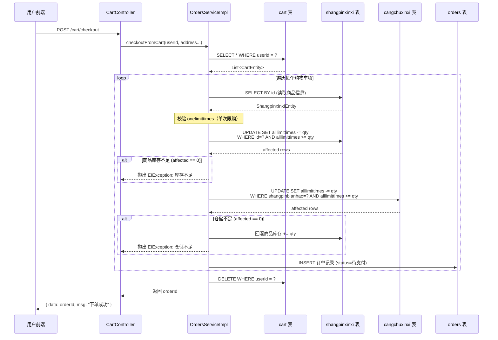
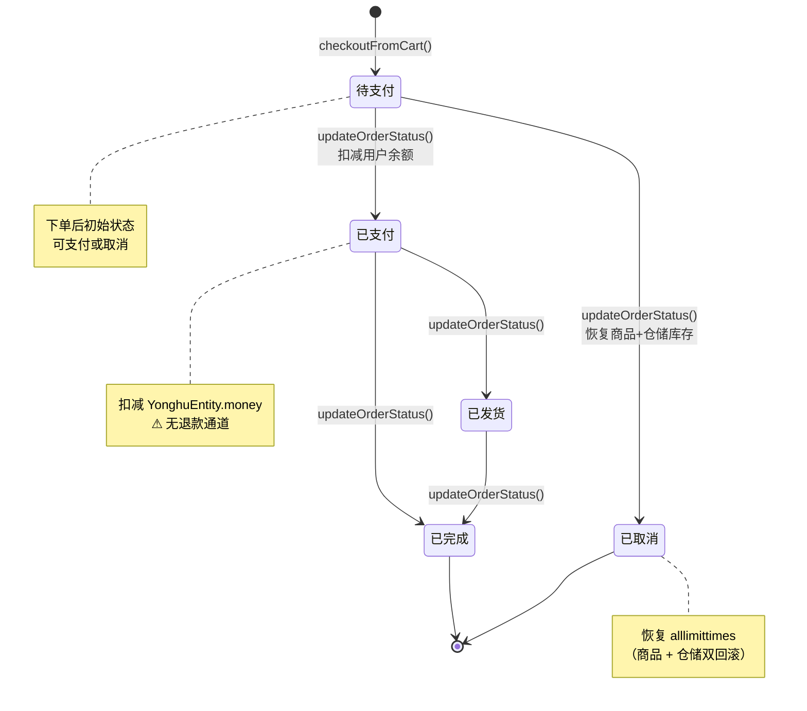
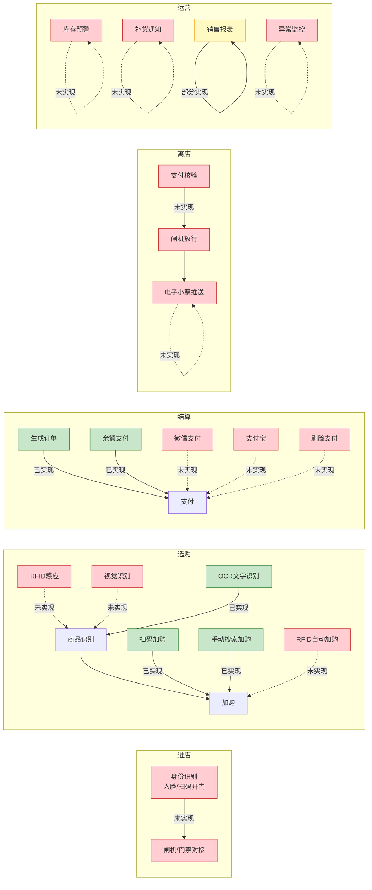

# 商品-仓储-购物车-订单数据流说明

> **编写日期**：2026-06-13
> **适用范围**：`springbootniyfl/` 当前代码的链路分析 + 完整无人收银缺口评估
> **附带文件**：本文档包含 Mermaid 数据流图，可在支持 Mermaid 的 Markdown 渲染器中查看

---

## 一、当前数据流总览（Mermaid）

```mermaid
flowchart TD
    subgraph 商品管理
        SP[ShangpinxinxiEntity<br/>shangpinxinxi 表<br/>━━━━━━━━━━<br/>id / shangpinbianhao 商品编号<br/>shangpinmingcheng 名称<br/>shangpinfenlei 分类<br/>onelimittimes 单次限购<br/>alllimittimes 可售库存<br/>price 单价]
    end

    subgraph 仓储管理
        CC[CangchuxinxiEntity<br/>cangchuxinxi 表<br/>━━━━━━━━━━<br/>id / shangpinbianhao 商品编号<br/>shangpinmingcheng 名称<br/>shengchanchangjia 厂家<br/>alllimittimes 上架数量]
    end

    subgraph 购物车
        CART[CartEntity<br/>cart 表<br/>━━━━━━━━━━<br/>userid / goodid<br/>goodname / buynumber<br/>price / discountprice]
    end

    subgraph 订单
        ORD[OrdersEntity<br/>orders 表<br/>━━━━━━━━━━<br/>orderid / userid / goodid<br/>buynumber / price / total<br/>status 状态<br/>address / tel / consignee]
    end

    subgraph 用户
        YH[YonghuEntity<br/>yonghu 表<br/>━━━━━━━━━━<br/>yonghuzhanghao 账号<br/>mima 密码(明文!)<br/>money 余额]
    end

    %% 手动录入
    ADMIN["管理员后台<br/>手动录入"] -->|"INSERT"| SP
    ADMIN -->|"INSERT"| CC

    %% 用户浏览与加购
    USER["用户/前端"] -->|"GET /shangpinxinxi/list<br/>浏览商品"| SP
    USER -->|"POST /cart/save<br/>手动加购"| CART
    USER -->|"POST /cart/recognize<br/>拍照OCR加购"| OCR["BaiduUtil.generalString()<br/>百度OCR识别"]
    OCR -->|"匹配商品编号/名称"| SP
    OCR -->|"写入购物车"| CART

    %% 结算下单
    USER -->|"POST /cart/checkout<br/>触发结算"| CHECKOUT["OrdersServiceImpl<br/>.checkoutFromCart()"]

    CHECKOUT -->|"1. 读取购物车项"| CART
    CHECKOUT -->|"2. 校验 onelimittimes"| SP
    CHECKOUT -->|"3. 原子扣减 WHERE<br/>alllimittimes >= qty"| SP
    CHECKOUT -->|"4. 原子扣减 WHERE<br/>alllimittimes >= qty"| CC
    CHECKOUT -->|"5. 生成订单(status=待支付)"| ORD
    CHECKOUT -->|"6. 清空购物车"| CART

    %% 支付
    USER -->|"POST /orders/status/{id}<br/>{status: 已支付}"| PAY["OrdersServiceImpl<br/>.updateOrderStatus()"]
    PAY -->|"扣减余额"| YH
    PAY -->|"更新状态"| ORD

    %% 取消
    USER -->|"POST /orders/status/{id}<br/>{status: 已取消}"| CANCEL["OrdersServiceImpl<br/>.updateOrderStatus()"]
    CANCEL -->|"恢复 alllimittimes"| SP
    CANCEL -->|"恢复 alllimittimes"| CC
    CANCEL -->|"更新状态"| ORD

    %% 推荐
    USER -->|"GET /shangpinxinxi/autoSort2<br/>协同推荐"| RECO["读取 orders 表<br/>按 shangpinfenlei 推荐"]
    RECO -->|"历史订单"| ORD
    RECO -->|"同类商品"| SP

    %% 样式
    style CHECKOUT fill:#e8f5e9,stroke:#43a047
    style PAY fill:#e3f2fd,stroke:#1565c0
    style CANCEL fill:#fff3e0,stroke:#e65100
    style OCR fill:#fce4ec,stroke:#c62828
    style SP fill:#f5f5f5,stroke:#616161
    style CC fill:#f5f5f5,stroke:#616161
    style CART fill:#f5f5f5,stroke:#616161
    style ORD fill:#f5f5f5,stroke:#616161
    style YH fill:#f5f5f5,stroke:#616161
```

---

## 二、结算下单时序图（Mermaid）



---

## 三、订单状态机（Mermaid）



---

## 四、当前链路缺口分析

### 4.1 商品（Shangpinxinxi） ↔ 仓储（Cangchuxinxi）

| # | 缺口 | 现状 | 影响 |
|---|------|------|------|
| G-1 | **无自动同步** | 新增商品（`/shangpinxinxi/save`）时不会自动创建仓储记录，仓储需管理员手动录入 | 仓储台账可能缺失，导致下单时仓储扣减失败 |
| G-2 | **关联仅靠 shangpinbianhao 文本** | `cangchuxinxi.shangpinbianhao` 与 `shangpinxinxi.shangpinbianhao` 无外键约束，无唯一索引 | 可能出现多条仓储记录对应同一商品，`deductStock` 只更新第一条匹配行 |
| G-3 | **无入库/出库流水** | 仅有 `alllimittimes` 总量字段，无出入库明细日志 | 无法追溯库存变动历史，无法对账 |
| G-4 | **无低库存预警** | 无阈值配置、无定时检查、无通知机制 | 缺货时无人知晓，直到用户下单失败 |
| G-5 | **无保质期管理** | 有 `shengchanriqi` 字段但无过期计算 | 无人超市售卖过期食品风险 |

### 4.2 购物车（Cart）→ 订单（Orders）

| # | 缺口 | 现状 | 影响 |
|---|------|------|------|
| G-6 | **无购物车过期清理** | 购物车无 `expire_time` 字段，无定时任务 | 长期不结算的购物车永久占用 |
| G-7 | **无幂等保护** | 结算接口无幂等 token 或分布式锁 | 网络抖动时用户重复提交可能产生重复订单（虽然购物车会被清空，但存在竞态窗口） |
| G-8 | **折扣价来源不明** | `CartEntity.discountprice` 字段由前端传入，服务端无促销/优惠券计算逻辑 | 前端可伪造折扣价 |
| G-9 | **结算不校验商品实时价格** | 结算时使用 `product.getPrice()` 生成订单价格，但 `cart.discountprice` 直接来自购物车记录 | 价格可能在加购后变更，结算时不一致 |

### 4.3 订单（Orders）→ 支付

| # | 缺口 | 现状 | 影响 |
|---|------|------|------|
| G-10 | **无真实支付渠道** | "已支付"状态由前端主动调用 `/orders/status/{id}` 设置，仅扣减平台内 `YonghuEntity.money` 余额 | 无法对接微信支付/支付宝/银行卡——**不是真正的收银系统** |
| G-11 | **无退款流程** | 取消订单恢复库存，但已支付的订单无法退款（状态机不允许"已支付→已取消"） | 用户付款后无法自助退款 |
| G-12 | **无订单超时自动取消** | 无延时队列/定时任务，"待支付"订单永不超时 | 未支付订单永远挂着，库存被占用无法释放 |
| G-13 | **支付与状态变更非原子** | `deductUserBalance()` 先扣余额再改状态，若中间异常可能出现余额已扣但状态未变 | 虽然有 `@Transactional`，但 `user.setMoney()` 使用 `updateById` 全量更新，存在并发覆盖风险 |
| G-14 | **余额扣减无并发保护** | `YonghuEntity.money` 通过 `selectById` → 计算 → `updateById` 三步操作 | 两笔订单并发支付可能导致余额计算错误（应使用 SQL 原子 `UPDATE money = money - amount WHERE money >= amount`） |

### 4.4 物流与履约

| # | 缺口 | 现状 | 影响 |
|---|------|------|------|
| G-15 | **无物流对接** | `OrdersEntity.logistics` 字段存在但从未被写入 | 无法追踪发货状态 |
| G-16 | **无电子小票/发票** | 无小票生成、打印或推送逻辑 | 无人超市需要提供购物凭证 |
| G-17 | **无自提柜/智能货柜对接** | 无相关接口 | 无人店场景下无法实现自动出货 |

### 4.5 安全与可靠性

| # | 缺口 | 现状 | 影响 |
|---|------|------|------|
| G-18 | **明文密码** | `YonghuEntity.mima` 与 `UsersEntity.password` 明文存储、明文比对 | 数据库泄露即全部账号沦陷 |
| G-19 | **无鉴权重置密码** | `/yonghu/resetPass` 标注 `@IgnoreAuth`，任何人可通过用户名重置他人密码为 "123456" | 严重安全漏洞 |
| G-20 | **SQL 注入风险** | `CommonDao.xml` 使用 `${}` 拼接表名/列名，通过 `CommonController` 对外暴露 | 攻击者可注入任意 SQL |
| G-21 | **ID 生成碰撞** | `new Date().getTime() + random(0~999)` 生成 ID，高并发下必然碰撞 | 订单号/购物车 ID 重复导致数据混乱 |
| G-22 | **fastjson 1.2.8 漏洞** | 已知多个反序列化 CVE | 远程代码执行风险 |

---

## 五、完整无人收银还缺哪些环节

下表按无人超市典型业务链排列，标注当前实现状态：



### 缺失环节清单

| 环节 | 缺失内容 | 优先级 | 说明 |
|------|----------|--------|------|
| **进店** | 身份识别（人脸识别/会员码扫码） | P0 | 无人店第一步，当前系统完全没有门禁对接 |
| **进店** | 闸机/电磁门控制接口 | P0 | 需要硬件协议对接（RS485/HTTP 控制板） |
| **选购** | RFID 标签读写 | P1 | 主流无人店方案，商品贴 RFID 标签，离店时通道门自动识别 |
| **选购** | 视觉识别（货架摄像头） | P2 | 计算机视觉方案，识别取货动作 |
| **选购** | 重力感应货架 | P2 | 通过重量变化判断取货 |
| **结算** | 微信支付对接 | P0 | 当前只有平台内余额支付，不是真实收银 |
| **结算** | 支付宝对接 | P0 | 同上 |
| **结算** | 刷脸支付 | P1 | 需要对接微信/支付宝刷脸支付 SDK + 3D 摄像头 |
| **结算** | 自动结算通道（RFID 通道门） | P1 | 顾客走过通道门自动识别所有商品并结算 |
| **离店** | 支付状态核验 + 闸机放行 | P0 | 未支付不能出店，需要门禁联动 |
| **离店** | 电子小票推送（短信/微信消息） | P1 | 购物凭证 |
| **售后** | 退款流程 | P0 | 已支付订单无法退款，状态机不允许逆向流转 |
| **运营** | 库存预警 + 自动补货通知 | P1 | 低库存时无任何告警 |
| **运营** | 订单超时自动取消 | P1 | 待支付订单永久挂起占用库存 |
| **运营** | 异常行为监控 | P2 | 未付款取货、破坏商品等场景 |

---

## 六、OCR 调用前提与密钥配置

### 6.1 调用入口

| 调用位置 | 方法 | 说明 |
|----------|------|------|
| `CartController.recognize()` | → `OrdersServiceImpl.recognizeAndAddToCart()` → `BaiduUtil.generalString(imagePath, false)` | 拍照识别商品并加购 |

### 6.2 密钥配置链路

```mermaid
flowchart LR
    ENV["环境变量<br/>━━━━━━━━━━━━<br/>BAIDU_OCR_APP_ID<br/>BAIDU_OCR_API_KEY<br/>BAIDU_OCR_SECRET_KEY"] -->|Spring EL 注入| YML["application.yml<br/>━━━━━━━━━━━━<br/>baidu.ocr.app-id: ${BAIDU_OCR_APP_ID:}<br/>baidu.ocr.api-key: ${BAIDU_OCR_API_KEY:}<br/>baidu.ocr.secret-key: ${BAIDU_OCR_SECRET_KEY:}"]
    YML -->|@Value 注入| UTIL["BaiduUtil.java<br/>━━━━━━━━━━━━<br/>@Value(\"${baidu.ocr.app-id:}\")<br/>private String appId;<br/>@Value(\"${baidu.ocr.api-key:}\")<br/>private String apiKey;<br/>@Value(\"${baidu.ocr.secret-key:}\")<br/>private String secretKey;"]
    UTIL -->|创建客户端| SDK["AipOcr 客户端<br/>━━━━━━━━━━━━<br/>new AipOcr(appId, apiKey, secretKey)<br/>basicAccurateGeneral() 方法"]
```

### 6.3 调用前提条件

| # | 条件 | 说明 |
|---|------|------|
| 1 | **必须配置环境变量** | `BAIDU_OCR_APP_ID`、`BAIDU_OCR_API_KEY`、`BAIDU_OCR_SECRET_KEY` 三者缺一不可。若为空，`AipOcr` 构造函数不会报错但 API 调用会返回认证失败 |
| 2 | **百度 AI 开放平台账号** | 需在 https://ai.baidu.com/ 创建"文字识别"应用，获取 AppId / ApiKey / SecretKey |
| 3 | **网络可达** | 服务器必须能访问 `aip.baidubce.com`（百度 AI 平台域名），边缘节点需注意网络出口 |
| 4 | **QPS 限制** | 百度 OCR 免费版 QPS 为 2（每秒 2 次），企业版可提升。多门店共用同一 AppId 时需限流 |
| 5 | **图片格式** | 支持 JPG/PNG/BMP，图片需清晰包含商品名称或编号文字，模糊图片识别率低 |
| 6 | **超时配置** | `application.yml` 中 `connection-timeout: 5000ms`（连接超时）、`socket-timeout: 60000ms`（读取超时），弱网环境建议调大 |

### 6.4 密钥配置位置一览

```
配置链路：
  环境变量 → application.yml → BaiduUtil.java → AipOcr SDK

具体文件位置：
  springbootniyfl/src/main/resources/application.yml  (第 29~36 行)
    baidu.ocr.app-id:          ${BAIDU_OCR_APP_ID:}
    baidu.ocr.api-key:         ${BAIDU_OCR_API_KEY:}
    baidu.ocr.secret-key:      ${BAIDU_OCR_SECRET_KEY:}
    baidu.ocr.connection-timeout: ${BAIDU_OCR_CONN_TIMEOUT:5000}
    baidu.ocr.socket-timeout:     ${BAIDU_OCR_SOCK_TIMEOUT:60000}

  springbootniyfl/src/main/java/com/utils/BaiduUtil.java  (第 25~37 行)
    @Value("${baidu.ocr.app-id:}")          → appId
    @Value("${baidu.ocr.api-key:}")         → apiKey
    @Value("${baidu.ocr.secret-key:}")      → secretKey
    @Value("${baidu.ocr.connection-timeout:5000}") → connectionTimeout
    @Value("${baidu.ocr.socket-timeout:60000}")    → socketTimeout
```

### 6.5 当前 OCR 匹配的局限性

| 问题 | 说明 |
|------|------|
| **全量扫描匹配** | `recognizeAndAddToCart()` 读取全部商品 (`selectList`) 后逐条比对，商品量大时性能差 |
| **匹配策略简单** | 仅支持文字包含匹配（`recognizedText.contains(商品编号/名称)`），不支持条码/二维码解析 |
| **误匹配风险** | 短商品名（如"水"）可能被误匹配到不相关商品 |
| **无置信度过滤** | OCR 返回结果未检查置信度，低置信度识别结果直接参与匹配 |
| **BaiduUtil 还有未使用的方法** | `animalDetect()`（动物识别）、`dishDetect()`（菜品识别）、`plantDetect()`（植物识别）——这些方法与超市业务无关，无人店场景下不需要 |

---

## 七、附录：核心数据表字段对照

| 表名 | 字段 | 类型 | 在结算中的角色 |
|------|------|------|---------------|
| `shangpinxinxi` | `id` | Long | 商品主键，购物车 `goodid` 引用 |
| | `shangpinbianhao` | String | 商品编号，关联仓储表 |
| | `onelimittimes` | Integer | 单次限购数量 |
| | `alllimittimes` | Integer | **可售库存**（结算时原子扣减） |
| | `price` | Float | 单价 |
| `cangchuxinxi` | `shangpinbianhao` | String | 商品编号（关联商品表的文本字段） |
| | `alllimittimes` | Integer | **上架数量**（结算时原子扣减） |
| `cart` | `userid` | Long | 用户 ID |
| | `goodid` | Long | 商品 ID |
| | `buynumber` | Integer | 购买数量 |
| | `discountprice` | Float | 折扣价（前端传入，服务端不校验） |
| `orders` | `orderid` | String | 统一订单号（同一批结算共享） |
| | `status` | String | 状态：待支付/已支付/已发货/已完成/已取消 |
| | `total` | Float | 总价 = price * buynumber |
| | `discounttotal` | Float | 折扣总价 |
| `yonghu` | `money` | Float | 用户余额（支付时扣减） |
